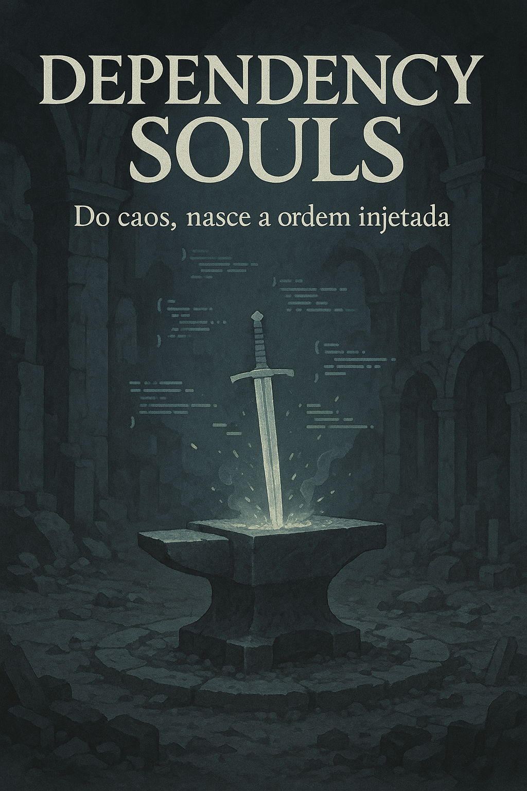

# Projeto EBOOK Gerado por I.A.s

Projeto com o objetivo de gerar um ebook digital com as facilidades das ferramentas de IA. todos os prompts
seguem abaixo.

<a href="https://github.com/Gabriel-Hen/ebook-dio/blob/master/output/ebook_injecao_dependencia.pdf" title="View PDF now"> 📕Clique aqui para ler</a>

## 💻 Tecnologias utilizadas no projeto

- [ChatGPT](https://chat.openai.com/)
- [PowerPoint](https://www.microsoft.com/en/microsoft-365/powerpoint)

## 🧠 Prompts

ChatGPT：

|   Ação   | prompt
| :------: | ------------------------------------------------------------------------------------------------------------------------------------------------------------------------------------------------------------------------------------------------------------------------------ |
|  título  | Crie um título de um ebook sobre o tema de injeção de dependencia, o ebook é do nicho de programação e o subnicho é de injeção de dependencia, o título deve ser épico e curto, e tenha uma temática de jogo souls like no título, me liste 5 variações de títulos                                                        |
|  capa    | gere uma imagem visual do 2 mas com uma paleta de cores mais pacata no estilo nord (aqui após eu ter falado qual o título escolhido ele sugeriu algumas ideias para capa)
| conteúdo | Faça um texto para o meu ebook, de injeção de depencias com foco em c#, faça no minimo 5 capitulos. No conteudo deve ter tambem quais os meios de realizar a injeção de dependencia e falar sobre os lifecicle dos diferentes tipos como Singleton, transcient e scope |

## 📚 Materiais

- Imagens utilizadas em `assets`
- ebook gerado em `output`

